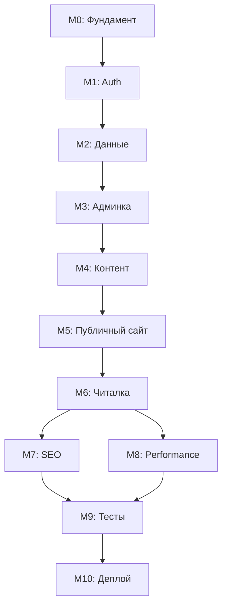

# План разработки фронтенда Bibliaris

> **Краткий обзор** | Полная версия: [DEVELOPMENT-PLAN.md](./DEVELOPMENT-PLAN.md)

## 📁 Документация плана

Эта папка содержит все материалы для планирования и трекинга разработки фронтенда:

- **[DEVELOPMENT-PLAN.md](./DEVELOPMENT-PLAN.md)** — полный верхнеуровневый план разработки
- **[QUICKSTART.md](./QUICKSTART.md)** — быстрый старт за 5 шагов
- **[TASKS-TRACKING.md](./TASKS-TRACKING.md)** — детальный трекинг задач по milestone'ам
- **README.md** (этот файл) — краткий обзор

---

## 🎯 Что мы строим

**Bibliaris** — мультиязычная платформа для чтения и прослушивания аудиокниг (en, es, fr, pt).

**Стек:** Next.js 14 (App Router) + TypeScript + Ant Design + React Query + NextAuth  
**Backend API:** https://api.bibliaris.com/api (уже готов ✅)

---

## 📋 10 этапов разработки

### 🏗️ Фундамент (M0-M2)

| #      | Этап                  | Что делаем                                  | Время    |
| ------ | --------------------- | ------------------------------------------- | -------- |
| **M0** | **Фундамент проекта** | Next.js + структура + i18n-роутинг          | 3-5 дней |
| **M1** | **Авторизация**       | NextAuth + JWT + защита админки             | 2-3 дня  |
| **M2** | **Данные и типы**     | TypeScript типы + React Query + HTTP-клиент | 2-3 дня  |

### 🎨 Контент и интерфейсы (M3-M6)

| #      | Этап               | Что делаем                                              | Время    |
| ------ | ------------------ | ------------------------------------------------------- | -------- |
| **M3** | **Админка MVP**    | Управление контентом (Books, Pages, Versions, Taxonomy) | 5-7 дней |
| **M4** | **Контент**        | Наполнение тестовыми данными                            | 1-2 дня  |
| **M5** | **Публичный сайт** | Страницы каталога + SEO                                 | 4-6 дней |
| **M6** | **Читалка/плеер**  | Чтение текста + аудиоплеер                              | 5-7 дней |

### ⚡ Оптимизация и запуск (M7-M10)

| #       | Этап               | Что делаем                       | Время    |
| ------- | ------------------ | -------------------------------- | -------- |
| **M7**  | **SEO**            | Sitemap, hreflang, микроразметка | 2-3 дня  |
| **M8**  | **Performance/UX** | Оптимизация, a11y, адаптив       | 3-4 дня  |
| **M9**  | **Тесты**          | Unit + E2E + CI                  | 3-5 дней |
| **M10** | **Деплой**         | Docker + CI/CD + production      | 2-3 дня  |

**Итого:** ~30-45 рабочих дней (1.5-2 месяца part-time)

---

## 🔄 Порядок выполнения



**Критический путь:** M0 → M1 → M2 → M3 → M4 → M5 → M6  
**Параллельно:** M7 и M8 можно делать одновременно

---

## 📚 Ключевая документация

### Перед началом (обязательно прочитать):

1. ✅ `docs/frontend-agents/README.md` — обзор
2. ✅ `docs/frontend-agents/backend-api-reference.md` — **API документация**
3. ✅ `docs/frontend-agents/quickstart.md` — быстрый старт

### По темам:

- **Auth:** `docs/frontend-agents/auth-next-auth.md`
- **Роутинг:** `docs/frontend-agents/architecture-and-routing.md`
- **SEO:** `docs/frontend-agents/seo.md`
- **API список:** `docs/frontend-agents/api-cheatsheet.md`

### Детальные ТЗ по этапам:

- `docs/milestones/M0-bootstrap.md`
- `docs/milestones/M1-auth-and-roles.md`
- `docs/milestones/M2-data-and-types.md`
- ... и так далее до M10

---

## 🚀 Как начать

### Шаг 1: Изучить документацию

```bash
# Читаем основные гайды
cat docs/frontend-agents/backend-api-reference.md
cat docs/frontend-agents/quickstart.md
```

### Шаг 2: Декомпозиция M0

```bash
# Изучить детальное ТЗ
cat docs/milestones/M0-bootstrap.md

# Создать конкретные задачи (issues/todo)
# Пример задач M0:
# - Инициализировать Next.js проект
# - Настроить Ant Design
# - Создать структуру app/[lang] и app/admin/[lang]
# - Добавить переключатели языка
# - Настроить ESLint и Prettier
```

### Шаг 3: Начать разработку M0

```bash
# Создать Next.js проект
npx create-next-app@latest books-app-front --typescript --app --eslint

# Установить зависимости
yarn add antd @ant-design/icons @tanstack/react-query next-auth
yarn add -D prettier eslint-config-prettier

# Настроить .env
cp .env.example .env
# Добавить NEXT_PUBLIC_API_BASE_URL=https://api.bibliaris.com/api
```

---

## 🎓 Методология

### Процесс работы над каждым milestone:

1. **Изучить** детальное ТЗ (`docs/milestones/M*.md`)
2. **Разбить** на конкретные задачи
3. **Реализовать** функционал
4. **Проверить** критерии приёмки
5. **Документировать** изменения
6. **Перейти** к следующему этапу

### Принципы:

- ✅ Каждый milestone даёт работающий результат
- ✅ Документация перед кодом
- ✅ TypeScript везде
- ✅ Mobile-first подход
- ✅ Тестирование критичных путей

---

## 🔧 Важные константы

### API Backend:

- **Production:** `https://api.bibliaris.com/api`
- **OpenAPI Schema:** `https://api.bibliaris.com/api/docs-json`

### Токены:

- **Access Token:** 12 часов
- **Refresh Token:** 7 дней

### Языки:

- **Поддерживаемые:** en, es, fr, pt
- **По умолчанию:** en

### Rate Limits:

- Login: 5 req/min
- Register: 3 req/5min
- Comments: 10 req/min

---

## ✅ Текущий статус

- [x] Документация изучена
- [x] План разработки составлен
- [ ] M0: Фундамент проекта — **СЛЕДУЮЩИЙ ШАГ**
- [ ] M1: Авторизация
- [ ] M2: Данные и типы
- [ ] ... (остальные этапы)

---

## 📝 Следующие действия

1. **Декомпозировать M0** на конкретные задачи
2. **Начать реализацию** фундамента проекта
3. **Проверить** критерии приёмки M0
4. **Перейти к M1** (авторизация)

---

**Полная версия плана:** [DEVELOPMENT-PLAN.md](./DEVELOPMENT-PLAN.md)  
**Дата создания:** 19 октября 2025  
**Статус:** Готов к работе ✅
